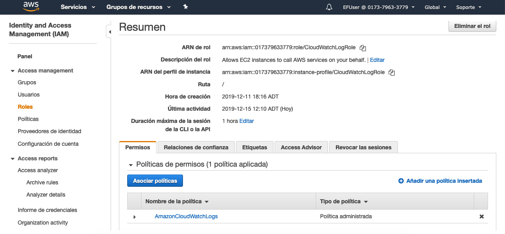

### Local NSA: Monitoreo de lo que tengan.

Al ser una aplicación tan sencilla, el único log que presenta es cuando se conecta o desconecta un socket del chat. 


`Connections.log`

`2019.12.11, 20:47:14.0285 UTC -> Socket connected successfully
2019.12.11, 20:47:18.0063 UTC -> Disconnected: sockets disconnected
2019.12.11, 21:54:58.0879 UTC -> Socket connected successfully
2019.12.12, 00:25:30.0268 UTC -> Socket connected successfully
2019.12.12, 00:44:25.0879 UTC -> Socket connected successfully
2019.12.12, 03:39:26.0095 UTC -> Socket connected successfully`

Este log, está siendo capturado por el servicio de *AWS CloudWatch* y mostrado en la consola como se aprecia a continuación.


Para que esa conexión funcionara, los pasos realizados fueron. 

Crear y asignar un *IAM ROLE* a la instancia EC2



Crear un *Log group* para la instancia. 


Luego en la instancia, se debe instalar el *CloudWatch Agent* a continuación se deja el archivo de configuración utilizado para el agente.

`/opt/aws/amazon-cloudwatch-agent/bin/config.json`

```json{
        "agent": {
                "metrics_collection_interval": 10,
                "run_as_user": "root"
        },
        "logs": {
                "logs_collected": {
                        "files": {
                                "collect_list": [
                                        {
                                                "file_path": "/home/ubuntu/socketchat/connections.log",
                                                "log_group_name": "MyLogSys",
                                                "log_stream_name": "{instance_id}"
                                        }
                                ]
                        }
                }
        },
        "metrics": {
                "append_dimensions": {
                        "AutoScalingGroupName": "${aws:AutoScalingGroupName}",
                        "ImageId": "${aws:ImageId}",
                        "InstanceId": "${aws:InstanceId}",
                        "InstanceType": "${aws:InstanceType}"
                },
                "metrics_collected": {
                        "mem": {
                                "measurement": [
                                        "mem_used_percent"
                                ],
                                "metrics_collection_interval": 10
                        },
                        "statsd": {
                                "metrics_aggregation_interval": 10,
                                "metrics_collection_interval": 10,
                                "service_address": ":8125"
                        },
                        "swap": {
                                "measurement": [
                                        "swap_used_percent"
                                ],
                                "metrics_collection_interval": 10
                        }
                }
        }
}
```

A la aplicación además se conectó con una herramienta de monitoreo. En este caso `Prometheus`.

Para hacer un *live review* ingresar **[Aquí](http://ec2-3-136-210-239.us-east-2.compute.amazonaws.com:9090/graph)**

La instalación de Prometheus consistió de los siguientes pasos:

Descargar la versión correspondiente al sistema operativo desde la página oficial 

`https://prometheus.io/download/`

Una vez teniendo los archivos en el servidor, se movieron dos archivos binarios `prometheus` y `promtools` a la carpeta `/etc/local/bin`

Luego, el archivo de configuración es el siguiente:

`ubuntu/home/prometheus-2.14.0.linux-amd64/prometheus.yml`
```yml
# my global config
global:
  scrape_interval:     15s # Set the scrape interval to every 15 seconds. Default is every 1 minute.
  evaluation_interval: 15s # Evaluate rules every 15 seconds. The default is every 1 minute.
  # scrape_timeout is set to the global default (10s).

# Alertmanager configuration
alerting:
  alertmanagers:
  - static_configs:
    - targets:
      # - alertmanager:9093

# Load rules once and periodically evaluate them according to the global 'evaluation_interval'.
rule_files:
  # - "first_rules.yml"
  # - "second_rules.yml"

# A scrape configuration containing exactly one endpoint to scrape:
# Here it's Prometheus itself.
scrape_configs:
  # The job name is added as a label `job=<job_name>` to any timeseries scraped from this config.
  - job_name: 'prometheus'

    # metrics_path defaults to '/metrics'
    # scheme defaults to 'http'.

    static_configs:
    - targets: ['localhost:9090']
```

Luego se dejó ejecutando en background con el siguiente comando: 

`nohup ./prometheus > prometheus.log 2>&1 &`

El último paso, fue habilitar en el *security group* de la instancia un inbound para el puerto 9090 qué es donde se correría prometheus.

Ejemplo de medición:

