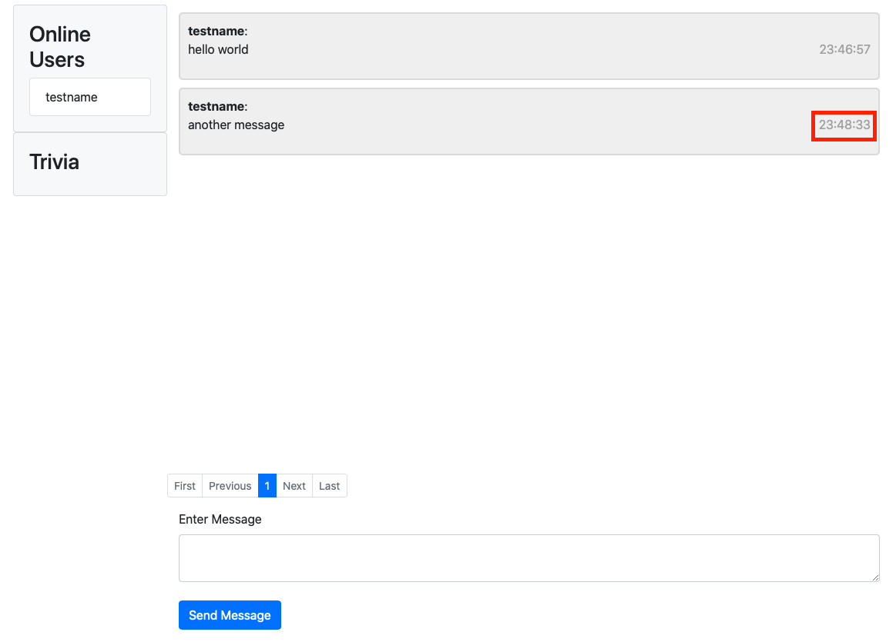

# Desafío 2: screw db hacks

Se utilizó Vault con secret engine transit para la encriptación de mensajes.

El cliente escribe su mensaje y previamente a ser enviado el servidor, este se encripta haciendo un request POST https://socketchat.tk:8200/v1/transit/encrypt/messages con el mensaje a encriptar y el token de Vault. Una vez recibido el mensaje encriptado, este se envía al servidor. Posteriormente, el servidor distribuye el mensaje encriptado por los web sockets y los clientes al recibir el mensaje hacen un POST a https://socketchat.tk:8200/v1/transit/decrypt/messages para desencriptar el mensaje que recibieron del server. Finalmente los usuarios pueden ver y enviar los mensajes con normalidad, mientras que el servidor solo maneja mensajes encriptados.

Vault esta configurado con storage de tipo file, CORS con allowed_origins: "*", tiene certifiacion ssl letsencrypt, y se aloja en el puerto 8200.

Para ver el funcionamiento de la encriptación, Se tienen que revisar los logs del servidor en Cloudwatch. El detalle esta en NSALOCAL.

Archivos de confoguración relevantes:

config.hcl (configuración de Vault server)

```JSON
listener "tcp" {
  address     = "0.0.0.0:8200"
  tls_cert_file="/etc/letsencrypt/live/socketchat.tk/fullchain.pem"
  tls_key_file="/etc/letsencrypt/live/socketchat.tk/privkey.pem"
}

storage "file" {
  path = "/vaultdb"
}

ui = true
api_addr = "https://0.0.0.0:8200"
```

vault.service (configuración para ejecutar Vault como servicio)
```
[Unit]
Description=Vault
Documentation=https://www.vault.io/

[Service]
ExecStart=/usr/bin/vault server -config=/etc/vault/config.hcl
ExecReload=/bin/kill -HUP $MAINPID
LimitNOFILE=65536

[Install]
WantedBy=multi-user.target
```

Log del servidor solo muestra mensaje encriptado.


El mismo mensaje a nivel cliente se despliega desencriptado.


Para encriptar primero se pasa el string a base64, lo contrario cuando se decripta.

